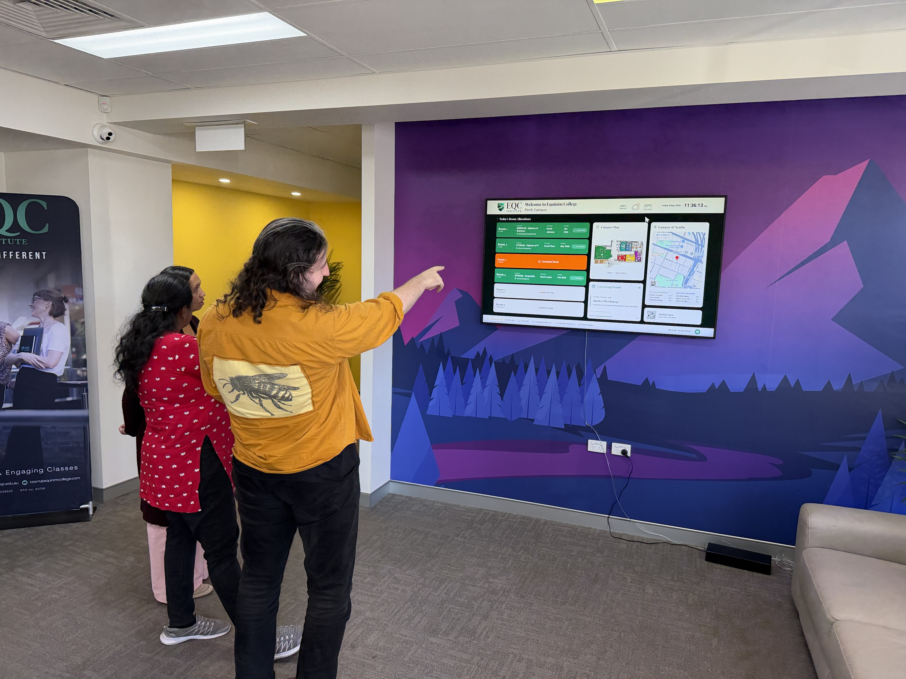
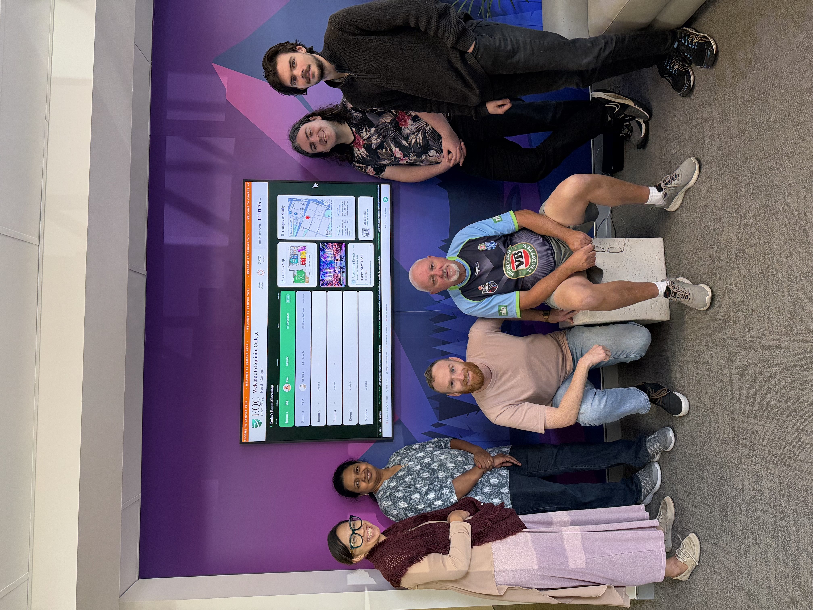
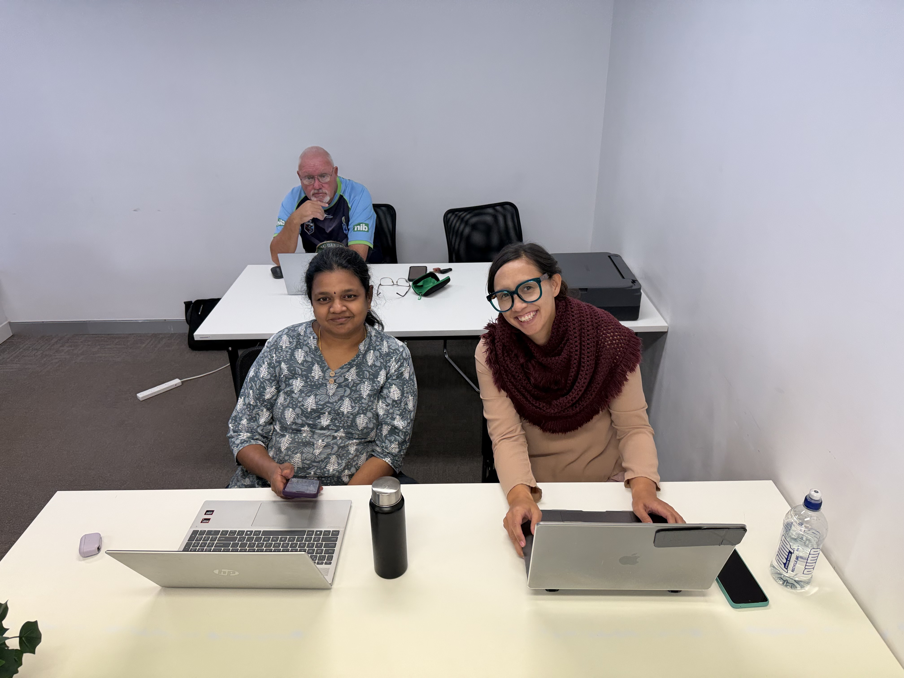

<p align="center">
  
</p>

<h1 align="center">EQC Perth Campus Dashboard</h1>

<p align="center">
  <strong>A real-time, multi-screen campus management system built by Intake 25G</strong><br/>
  <em>Equinim College &middot; Perth Campus &middot; West Perth, WA</em>
</p>

<p align="center">
  <a href="https://www.perth-eqc.xyz"></a>
  <a href="#"></a>
  <a href="#"></a>
  <a href="#"></a>
  <a href="#"></a>
</p>

---

<p align="center">
  
</p>

<p align="center"><em>Intake 25G reviewing the live dashboard on the campus lobby screen &mdash; shipped, running, and updating in real time.</em></p>

---

## What is this?

The **EQC Perth Campus Dashboard** is a full-stack web application that powers the lobby display at the Equinim College Perth campus. It runs 24/7 on a mounted screen in the reception area, showing visitors and students:

- **Who is teaching in which room** &mdash; updated live as trainers sign on and off
- **Campus floor plan** &mdash; interactive SVG map of the Level 1 campus layout
- **Upcoming events** &mdash; graduation galas, guest speakers, assessment deadlines
- **Scrolling news ticker** &mdash; curated RSS feeds from cybersecurity, web dev, and local Perth news
- **Campus life carousel** &mdash; rotating photos of student activities
- **WiFi credentials** &mdash; network name and password for visitors
- **Emergency info** &mdash; fire assembly point, first aid location, campus contacts
- **QR code** &mdash; scan to open the mobile companion on your phone

It's not just a display. Behind the scenes, the system includes a **trainer sign-on portal**, a **9-panel admin dashboard**, a **mobile companion app**, and an **automated nightly reset** &mdash; all synced in real time through Firebase Firestore.

This project was built from scratch by the students of **Intake 25G** during their Web Development unit at EQC Institute, under the supervision of trainer **Timothy Daly**.

---

## Meet the Team

<p align="center">
  
</p>

<p align="center"><em>The Intake 25G crew. From left: Chelsea, Senthamizhselvi, Tim, Neil, Walter, Alex.</em></p>

| Name | Role | What They Did |
|------|------|---------------|
| **Timothy Daly** | Trainer & Project Manager | Architected the system, mentored the team, managed Firebase infrastructure, and drove the project from concept to production deployment |
| **Chelsea Reupena** | Front End Manager | Led the lobby display design, built responsive layouts, implemented the room allocation cards and campus information panels |
| **Jarrahd Gibson** | Back End Manager | Owned the Firebase backend &mdash; Firestore collections, Storage buckets, real-time data hooks, and the auto-reset system |
| **Joseph O'Donnell** | Project Coordinator | Managed sprint planning, tracked deliverables, coordinated between front-end and back-end teams, and ensured features shipped on schedule |
| **Senthamizhselvi Baskaran** | Full-Stack Support | Worked across the stack &mdash; from admin panel components to Firestore integration, CSS refinements, and mobile layout adjustments |
| **Walter Harvey** | Full-Stack Support | Contributed to both the trainer sign-on interface and admin panels, implemented form validation and real-time data binding |
| **Neil Hart** | Front End Support | Built UI components for the mobile companion view, styled the events carousel, and refined the responsive breakpoints |
| **Alex Green** | Project Support Officer | Assisted with testing, QA, asset management, and documentation &mdash; the glue that kept things moving |
| **Clare Stone** | Quality & Compliance Officer | Ensured RTO compliance requirements were met in the footer, validated accessibility standards, and reviewed content accuracy |
| **Duke McNouget Daly** | Branch Officer | Provided morale support and supervised lunch breaks |

<p align="center">
  
</p>

<p align="center"><em>Senthamizhselvi, Chelsea, and Neil grinding through a sprint in the classroom.</em></p>

---

## The Four Interfaces

This isn't a single page &mdash; it's a **multi-interface system** with four distinct views, each designed for a different user:

### 1. Lobby Display (`/`)

The main event. This runs full-screen on the campus TV and is designed to be read from across the room.

**What you see:**
- **Room allocation board** &mdash; 6 rooms showing trainer name, photo, course, intake number, and live/break/available status. Available rooms glow light green with ghost placeholder shapes where the trainer info will appear
- **Campus floor plan** &mdash; SVG map rendered at crisp resolution on any screen size
- **Image carousel** &mdash; rotating campus life photos with configurable slide duration and transitions
- **Events tile** &mdash; upcoming events with auto-rotation and dot navigation
- **Google Maps embed** &mdash; interactive campus location with nearby cafes and transport
- **Nearby amenities** &mdash; walking distances to Gordon St Garage, Pony Express, City West Station
- **News ticker** &mdash; scrolling RSS headlines from 21 curated feeds across 5 categories
- **Footer** &mdash; RTO number, CRICOS code, address, phone, email, emergency info, and QR code

**Technical highlights:**
- Firebase `onSnapshot` listeners push updates to every connected screen instantly
- Break countdown timers update every second with live remaining-time display
- Framer Motion handles smooth transitions on the carousel and event rotation
- Fully responsive grid layout with `grid-rows-[2fr_1.5fr_0.8fr]` for the right panel

---

### 2. Mobile Companion (`/mobile`)

Students scan the QR code on the lobby screen and get this on their phone.

**What you see:**
- Compact room status cards with trainer photo, name, intake, and course
- Campus contact info with tap-to-call and tap-to-email
- Embedded Google Map
- Upcoming events in a horizontal scroll carousel
- WiFi credentials with tap-to-copy
- Staff contacts section
- Expandable RSS news feed
- Fixed bottom navigation: Lobby / Sign On / Map

**Technical highlights:**
- Fully responsive design optimised for 390px+ viewports
- `snap-x snap-mandatory` CSS for smooth horizontal event scrolling
- `navigator.clipboard` API for one-tap WiFi credential copying
- React Hot Toast for copy confirmation feedback

---

### 3. Trainer Sign-On Portal (`/trainer-sign-on`)

Trainers use this to check in for their classes. When they sign on, the lobby display updates in real time.

**What you see:**
- Currently signed-on trainers with expandable detail cards
- Sign-on form: trainer name, room, course, intake, topic
- Break management: preset durations (15/30/45/60 min) or custom input
- Live break countdown with visual timer
- Sign-off button with confirmation
- Trainer photo update with inline cropping

**Technical highlights:**
- Sign-on/sign-off events are logged to the `signOnLog` Firestore collection for audit trail
- Break duration stored as ISO timestamp (`breakUntil`) for precise countdown calculation
- React Easy Crop provides circular crop interface for trainer profile photos
- Photos uploaded to Firebase Storage at 512px width, JPEG format

---

### 4. Admin Dashboard (`/admin`)

Password-protected control centre with 9 management panels:

| Panel | What it controls |
|-------|-----------------|
| **Rooms** | Manual room allocation override, status management, intake dropdown, Reset All (rooms return to available) |
| **Events** | Create/edit/delete events with 22 icon options and date picker |
| **Alerts** | Scrolling announcements with color, size, speed, emoji, and expiry controls |
| **Carousel** | Campus life photo management with 16:9 crop, zoom, rotation, and reorder |
| **Trainers** | Trainer profiles with photo upload, crop, bio, per-trainer login password, and active/inactive toggle |
| **Intakes** | Intake register (e.g. 25.G) with course, start date, and notes &mdash; feeds the Rooms intake dropdown |
| **Sign-On Log** | Colour-coded, searchable, paginated history &mdash; trainer sign-ons in green, nightly auto-resets in black, Reset All in orange, admin edits in grey. All times in WA (Perth), 12-hour |
| **RSS Feeds** | 21 curated feeds across 5 categories with enable/disable and custom URL support |
| **Settings** | WiFi credentials, carousel timing, daily reset hour, RSS refresh interval, staff contacts, floor plan image |

**Technical highlights:**
- Sidebar navigation with React Router nested routes
- Password gate via `VITE_ADMIN_PASSWORD` environment variable, plus per-trainer passwords managed in the Trainers panel
- Carousel images processed to WebP format at 1920px width for optimal file size
- Atomic Firestore `writeBatch` operations for carousel reordering
- Real-time preview for announcement styling before publishing
- Admin room changes write to the sign-on log so every edit is auditable

---

## Tech Stack

This project uses a modern, production-grade stack:

| Layer | Technology | Version | Purpose |
|-------|-----------|---------|---------|
| **Framework** | React | 19.0.0 | Component architecture with hooks |
| **Language** | TypeScript | ~5.8 | Full type safety across the entire codebase |
| **Build** | Vite | 6.2.0 | Lightning-fast HMR and optimised production builds |
| **Routing** | React Router | 7.15.0 | Client-side navigation with nested admin routes |
| **Database** | Firebase Firestore | 12.13.0 | Real-time NoSQL database with `onSnapshot` listeners |
| **Storage** | Firebase Storage | 12.13.0 | Trainer photos, carousel images, floor plan |
| **Styling** | Tailwind CSS | 4.1.14 | Utility-first CSS with custom `eqc-green` (#1a7a54) theme |
| **Animation** | Framer Motion | 12.23.24 | Smooth transitions, `AnimatePresence`, and spring physics |
| **Icons** | Lucide React | latest | 40+ icons used across the interface |
| **Notifications** | React Hot Toast | 2.6.0 | Non-intrusive success/error toasts |
| **Image Crop** | React Easy Crop | 5.5.7 | Circular and rectangular crop with zoom and rotation |
| **QR Code** | qrcode.react | 4.2.0 | Dynamic QR code generation for lobby display |
| **RSS** | rss-parser | 3.13.0 | Parse feeds from 21 curated news sources |
| **Hosting** | Vercel | &mdash; | Auto-deploy on push to `main`, custom domain |

---

## Architecture & Data Flow

```
                    +------------------+
                    |   Vercel (CDN)   |
                    | www.perth-eqc.xyz|
                    +--------+---------+
                             |
              +--------------+--------------+
              |              |              |
         +----+----+   +----+----+   +-----+-----+
         |  Lobby  |   | Mobile  |   |  Trainer   |
         | Display |   |Companion|   |  Sign-On   |
         +----+----+   +----+----+   +-----+-----+
              |              |              |
              +--------------+--------------+
                             |
                    +--------+----------+
                    | Firebase Firestore|  <-- Real-time onSnapshot listeners
                    |  10 Collections   |
                    +--------+----------+
                             |
                    +--------+---------+
                    | Firebase Storage |  <-- Trainer photos, carousel, floor plan
                    +--------+---------+
                             |
                    +--------+---------+
                    |   Admin Panel    |  <-- Password-protected, 9 panels
                    +------------------+
```

### Firestore Collections

| Collection | Documents | Real-time? | Purpose |
|-----------|-----------|:----------:|---------|
| `rooms` | 6 | Yes | Current room allocations (reset nightly to available) |
| `trainers` | Dynamic | Yes | Trainer profiles with photos and login passwords |
| `intakes` | Dynamic | Yes | Intake register feeding the Rooms dropdown |
| `events` | Dynamic | Yes | Upcoming and past events |
| `announcements` | Dynamic | Yes | Active scrolling alerts (auto-expire) |
| `carousel` | Dynamic | Yes | Ordered campus life photos |
| `signOnLog` | Append-only | Yes | Sign-on/sign-off, reset, and admin-edit audit trail |
| `rssFeeds` | 21+ | Yes | RSS feed source configuration |
| `staff` | Dynamic | Yes | Staff member records |
| `settings/global` | 1 | Yes | App-wide configuration singleton |

---

## Key Technical Patterns

### Real-Time Data Hooks

Every piece of data in this app updates in real time. No polling, no manual refresh. When a trainer signs on in Room 3, every lobby screen, every mobile view, and every admin panel reflects the change instantly.

```typescript
// Every hook follows this pattern
export function useRooms() {
  const [rooms, setRooms] = useState<RoomAllocation[]>([]);
  useEffect(() => {
    const unsub = onSnapshot(collection(db, 'rooms'), (snapshot) => {
      const data = snapshot.docs.map(d => d.data() as RoomAllocation);
      data.sort((a, b) => a.id - b.id);
      setRooms(data);
    });
    return unsub; // cleanup on unmount
  }, []);
  return [rooms, setRooms] as const;
}
```

### Automated Nightly Reset

At 10:00 PM (Perth time) every night, all rooms reset to "Available" automatically. If the dashboard was powered off overnight, the system catches up on the missed reset when it boots the next morning. Every reset &mdash; automatic or manual &mdash; is written to the sign-on log.

```typescript
// Anchored to Australia/Perth so a kiosk on UTC still resets at the right hour
const lastReset = localStorage.getItem('eqc-last-reset-date');
if (lastReset !== today) {
  // Reset all rooms to 'available'
  // Log the reset, mark today as done
}
```

### Image Processing Pipeline

Trainer photos and carousel images go through a full processing pipeline:

1. **File selection** &rarr; validate format and size
2. **Data URL conversion** &rarr; `readFileAsDataURL()`
3. **Crop modal** &rarr; React Easy Crop with zoom (1-4x) and rotation (-180 to 180 deg)
4. **Blob extraction** &rarr; `getCroppedBlob()` at target resolution
5. **Upload** &rarr; Firebase Storage (trainers: 512px JPEG, carousel: 1920px WebP)
6. **Firestore reference** &rarr; URL stored in document
7. **UI update** &rarr; instant via `onSnapshot` listener

### Stale Event Filter

The events display automatically hides past events, even if the dashboard has been running continuously for days. A `todayKey` dependency forces the `useMemo` to recompute when the calendar date changes:

```typescript
const todayKey = new Date().toDateString();
const upcomingEvents = useMemo(() => {
  const today = new Date();
  today.setHours(0, 0, 0, 0);
  return events.filter(e => new Date(e.date) >= today);
}, [events, todayKey]);
```

---

## Project Structure

```
eqc-welcome-board/
  src/
    App.tsx                    # Router configuration (15 routes)
    main.tsx                   # React 19 entry point
    index.css                  # Tailwind v4 + custom theme
    lib/
      firebase.ts              # Firebase app initialisation
      hooks.ts                 # 12 custom hooks (rooms, events, trainers, intakes, etc.)
      types.ts                 # 16 TypeScript interfaces
      storage.ts               # Upload, crop, delete utilities
      intake.ts                # Intake number (XX.X) parsing and validation
      rss.ts                   # RSS ticker aggregation hook
      trainers.ts              # Known trainer photo path resolver
      trainerPasswords.ts      # Per-trainer login password helpers
    pages/
      Lobby.tsx                # Main lobby display (~900 lines)
      Mobile.tsx               # Mobile companion view
      TrainerSignOn.tsx        # Trainer sign-on portal (~780 lines)
      Admin.tsx                # Admin shell with sidebar
      admin/
        Rooms.tsx              # Room management + intake dropdown
        Events.tsx             # Event scheduling + icon picker
        Alerts.tsx             # Announcement system
        Carousel.tsx           # Photo carousel management
        Trainers.tsx           # Trainer profile management
        Intakes.tsx            # Intake register management
        RssFeeds.tsx           # RSS feed configuration
        Settings.tsx           # Global settings
        SignOnLog.tsx          # Colour-coded attendance history
  public/
    images/                    # Static assets (SVG floor plan, team photos)
```

---

## Routes

| Route | Access | Purpose |
|-------|--------|---------|
| `/` | Public | Lobby dashboard &mdash; the campus TV screen |
| `/mobile` | Public | Mobile companion &mdash; scan QR to view |
| `/trainer-sign-on` | Public | Trainer sign-on &mdash; room + break management |
| `/admin` | Password | Admin login gate (admin or per-trainer password) |
| `/admin/rooms` | Password | Room allocation management |
| `/admin/events` | Password | Event scheduling with icon picker |
| `/admin/alerts` | Password | Scrolling banner alerts |
| `/admin/carousel` | Password | Campus life photo carousel |
| `/admin/trainers` | Password | Trainer profiles + photo upload |
| `/admin/intakes` | Password | Intake register (feeds Rooms dropdown) |
| `/admin/signon-log` | Password | Colour-coded sign-on/sign-off audit history |
| `/admin/rss` | Password | RSS news ticker feed management |
| `/admin/settings` | Password | WiFi, contacts, reset time, carousel timing |

---

## RSS News Feeds

The lobby ticker aggregates headlines from **21 curated feeds** across 5 categories:

| Category | Feeds | Examples |
|----------|:-----:|---------|
| **Cybersecurity** | 6 | The Hacker News, Krebs on Security, BleepingComputer, Dark Reading, CISA Alerts |
| **Web Development** | 5 | Smashing Magazine, Dev.to, freeCodeCamp, CSS-Tricks, Web.dev |
| **General Tech** | 5 | TechCrunch, Ars Technica, The Verge, Wired, Hacker News |
| **Local (Perth/WA)** | 3 | ABC News Perth, PerthNow, WA Today |
| **Safety & WHS** | 2 | Safe Work Australia, WorkSafe WA News |

Feed management is handled through the admin panel &mdash; enable/disable individual feeds, add custom URLs, configure scroll speed and ribbon styling.

---

## Local Development

**Prerequisites:** Node.js 20+

```bash
git clone https://github.com/thedalycreative/eqc-welcome-board.git
cd eqc-welcome-board
npm install
npm run dev        # http://localhost:5173
```

### Scripts

| Script | What it does |
|--------|-------------|
| `npm run dev` | Start Vite dev server with hot reload |
| `npm run build` | Production build to `dist/` |
| `npm run lint` | TypeScript type check (`tsc --noEmit`) |
| `npm run preview` | Preview production build locally |

### Environment Variables

| Variable | Required | Notes |
|----------|:--------:|-------|
| `VITE_FIREBASE_API_KEY` | Yes | Firebase project API key |
| `VITE_FIREBASE_AUTH_DOMAIN` | Yes | Firebase auth domain |
| `VITE_FIREBASE_PROJECT_ID` | Yes | Firebase project ID |
| `VITE_FIREBASE_STORAGE_BUCKET` | Yes | Firebase storage bucket |
| `VITE_FIREBASE_MESSAGING_SENDER_ID` | Yes | Firebase messaging sender ID |
| `VITE_FIREBASE_APP_ID` | Yes | Firebase app ID |
| `VITE_ADMIN_PASSWORD` | Recommended | Admin panel password |
| `VITE_DEMO_MODE` | Optional | Set to `"true"` for offline demo mode |

Firestore and Storage security rules live in `firestore.rules` and `storage.rules`, deployed with `firebase deploy --only firestore,storage`.

---

## Deployment

The project auto-deploys to **Vercel** on every push to `main`.

- **Production URL:** [www.perth-eqc.xyz](https://www.perth-eqc.xyz)
- **Deployment checks:** TypeScript type checking runs on every deploy
- **Custom domain:** `perth-eqc.xyz` with `www` redirect, registered through Vercel

---

## Compliance

This dashboard runs in the lobby of a **Registered Training Organisation**. The footer displays legally required information:

- **RTO 45758** &middot; **CRICOS 03952E**
- Campus address: 2 Gordon St, West Perth WA 6005
- Phone: 1800 338 883
- Email: team@equinimcollege.com
- Fire assembly point: Coolgardie St
- First aid location: Kitchen

These elements are regulatory requirements and must not be removed.

---

## Links

| | URL |
|---|---|
| **Live Site** | [www.perth-eqc.xyz](https://www.perth-eqc.xyz) |
| **Mobile View** | [www.perth-eqc.xyz/mobile](https://www.perth-eqc.xyz/mobile) |
| **Trainer Sign-On** | [www.perth-eqc.xyz/trainer-sign-on](https://www.perth-eqc.xyz/trainer-sign-on) |
| **Admin Panel** | [www.perth-eqc.xyz/admin](https://www.perth-eqc.xyz/admin) |
| **GitHub Repo** | [github.com/thedalycreative/eqc-welcome-board](https://github.com/thedalycreative/eqc-welcome-board) |

---

<p align="center">
  
</p>

<p align="center"><strong>The Class of '87</strong><br/><em>Some things never change. The hair does.</em></p>

---

<p align="center">
  Built with genuine effort, questionable commit messages, and an unreasonable amount of Tailwind classes.<br/>
  <strong>Intake 25G &middot; EQC Institute &middot; Perth Campus &middot; 2025&ndash;2026</strong>
</p>
